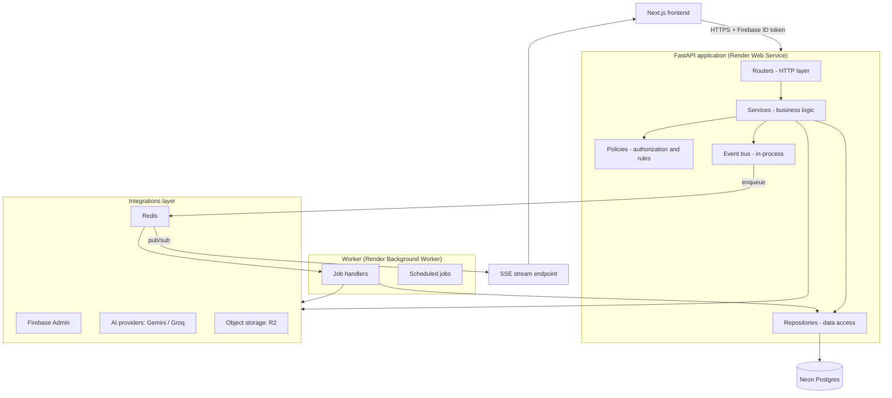
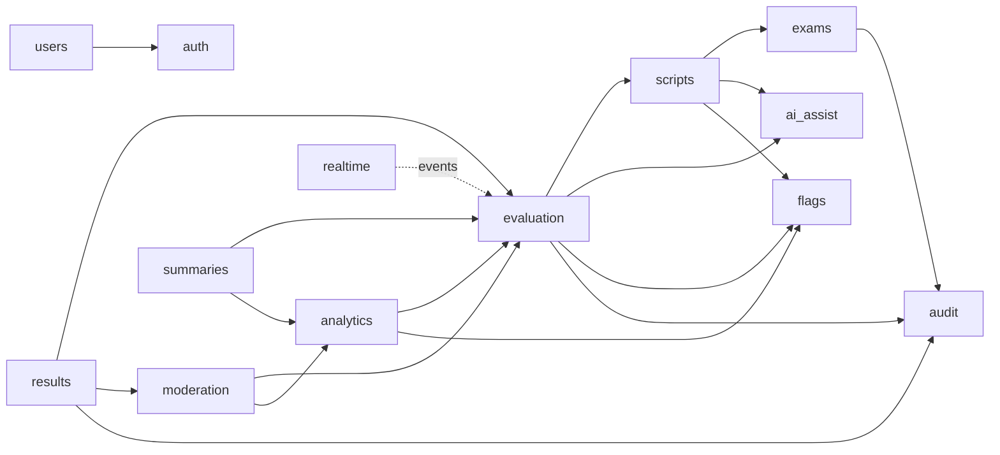
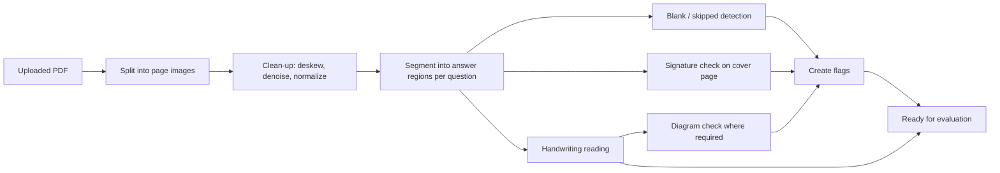

backend.md

# Backend

## ExamSetu AI: Intelligent On-Screen Marking & Evaluation Ecosystem

|                       |                                                |
| --------------------- | ---------------------------------------------- |
| **Document status**   | Draft v1.0                                     |
| **Date**              | 30 September 2026                              |
| **Related documents** | PRD.md, techstack.md, frontend.md, database.md |

**Stack details are in `techstack.md`** (FastAPI, Neon Postgres, Firebase Auth,
Redis + ARQ, Cloudflare R2, Gemini and Groq Python SDKs, SSE, Ed25519 signing).
**Table and column design is in `database.md`.** This file covers the
**architecture, module structure, business logic, API conventions and
engineering standards** of the backend.

Numbers marked _(default)_ are starting values that the Controller/Admin can
configure and that should be calibrated during the pilot; they are proposals,
not validated figures.

---

## 1. Backend Responsibilities

The backend is the **single system of record** and the only place where rules
are enforced and AI is called.

1. Verify identity and enforce role-based access on every request.
2. Manage exams, papers, scripts, assignments and users.
3. Process scanned scripts (pages, regions, blank checks, handwriting reading).
4. Produce AI evaluation support and store it separately from human decisions.
5. Record examiner marks, overrides and completion under strict rules.
6. Detect completeness problems, scoring anomalies and possible malpractice.
7. Route risky sheets to second evaluation and reconcile outcomes.
8. Compute analytics and push live updates.
9. Maintain a tamper-evident, signed audit trail.
10. Finalize and export signed results.

**Non-negotiable invariants**

| #   | Invariant                                                                                                                             |
| --- | ------------------------------------------------------------------------------------------------------------------------------------- |
| I-1 | AI output never becomes a mark. Only an examiner's explicit action (or a reconciliation by the Controller) creates a mark.            |
| I-2 | Every mark, change, override, flag decision, moderation decision and finalization writes an audit record **in the same transaction**. |
| I-3 | Examiner-facing responses never contain student identity.                                                                             |
| I-4 | All authorization is enforced here; the frontend is never trusted.                                                                    |
| I-5 | AI failure never blocks evaluation.                                                                                                   |
| I-6 | Numbers in summaries always come from stored data, never from an LLM.                                                                 |

## 2. Architecture

### 2.1 Style: modular monolith with a background worker

One FastAPI codebase divided into **self-contained modules**, deployed as two
processes from the same image (API and worker). This keeps deployment simple for
the prototype while keeping module boundaries clean enough to split into
services later if needed.



### 2.2 Layering rules

| Layer                  | Does                                                                             | Must not                                   |
| ---------------------- | -------------------------------------------------------------------------------- | ------------------------------------------ |
| **Router**             | Parse request, call one service method, shape response, declare permissions      | Contain business rules or database queries |
| **Service**            | Business logic, transactions, orchestration, publishing events                   | Build SQL or call the HTTP framework       |
| **Policy**             | Pure functions answering "is this allowed?" (ownership, status, role)            | Touch the database or network              |
| **Repository**         | All database access for its module                                               | Contain business decisions                 |
| **Integration client** | Wrap one external system (Firebase, Gemini, Groq, R2, Redis) behind an interface | Leak provider types into services          |
| **Schema (Pydantic)**  | Request/response/AI-output contracts                                             | Contain logic                              |
| **Model (SQLAlchemy)** | Persistence mapping                                                              | Be returned directly from the API          |

**Module rules**

1. A module talks to another module **only through that module's service
   interface** (never its repository or models).
2. Cross-module reactions use **domain events** (e.g. `EvaluationCompleted`),
   not direct calls, to avoid circular dependencies.
3. Shared, dependency-free helpers live in `core/`; nothing in `core/` imports
   from `modules/`.
4. Dependency direction:
   `router → service → (policy, repository, integrations)`; modules depend
   downward on `core`, never on routers.

### 2.3 Folder structure

```
backend/
├─ app/
│  ├─ main.py                      ← app factory, router registration, middleware, lifespan
│  ├─ core/
│  │   ├─ config.py                ← typed settings (pydantic-settings)
│  │   ├─ security.py              ← token verification, current-user dependency, require_role
│  │   ├─ errors.py                ← exception classes and handlers (one error format)
│  │   ├─ logging.py               ← structured JSON logging, request IDs
│  │   ├─ events.py                ← domain event bus
│  │   ├─ pagination.py  ids.py  time.py  hashing.py
│  │   └─ deps.py                  ← shared FastAPI dependencies (db session, settings)
│  ├─ db/
│  │   ├─ base.py                  ← declarative base, naming conventions
│  │   └─ session.py               ← engine, session factory, unit-of-work
│  ├─ integrations/
│  │   ├─ firebase/  client.py
│  │   ├─ ai/        base.py  gemini.py  groq.py  router.py
│  │   ├─ storage/   base.py  r2.py
│  │   └─ redis/     client.py  pubsub.py
│  ├─ modules/
│  │   ├─ auth/          users/        exams/       scripts/
│  │   ├─ evaluation/    ai_assist/    flags/       moderation/
│  │   ├─ analytics/     realtime/     audit/       results/
│  │   └─ summaries/
│  │      └─ (each module contains)
│  │          router.py  schemas.py  service.py  repository.py
│  │          models.py  policies.py  events.py  tasks.py  exceptions.py
│  └─ workers/
│      ├─ settings.py              ← ARQ worker configuration, queues
│      └─ cron.py                  ← scheduled jobs
├─ migrations/                     ← Alembic
├─ tests/
│  ├─ unit/  integration/  e2e/  fixtures/
├─ scripts/                        ← seed data, key generation, maintenance
├─ pyproject.toml   Dockerfile   .env.example   Makefile
└─ README.md
```

## 3. Module Overview

| Module         | Owns                                                                                       | Depends on (service interface)                      |
| -------------- | ------------------------------------------------------------------------------------------ | --------------------------------------------------- |
| **auth**       | Token verification, current user context, role checks                                      | users                                               |
| **users**      | User accounts, roles, lifecycle, Firebase user provisioning                                | auth (context), audit                               |
| **exams**      | Exams, papers, question structure, optional rubrics, configuration                         | audit                                               |
| **scripts**    | Script upload, pages, answer regions, identity separation, processing pipeline             | exams, storage, ai_assist, flags                    |
| **evaluation** | Assignments, evaluations, marks, overrides, completion                                     | exams, scripts, ai_assist, flags, audit             |
| **ai_assist**  | Handwriting reading, score-band suggestions, diagram checks (via AI providers)             | exams, evaluation (read-only context)               |
| **flags**      | Flags: detection results, lifecycle, resolution                                            | audit                                               |
| **moderation** | Risk scoring, routing, second evaluation, reconciliation                                   | evaluation, analytics, exams, audit                 |
| **analytics**  | Examiner metrics, peer comparison, anomaly and malpractice detection, dashboard aggregates | evaluation, flags                                   |
| **realtime**   | SSE stream, event fan-out                                                                  | (subscribes to events)                              |
| **audit**      | Signed hash-chained audit records, verification                                            | (called by others; depends on none)                 |
| **results**    | Finalization, tabulation, signed export                                                    | evaluation, moderation, flags, audit, storage       |
| **summaries**  | Per-sheet and per-batch summaries                                                          | evaluation, flags, moderation, analytics, ai_assist |



## 4. Roles and Permissions

Roles come from Firebase custom claims and are cross-checked with the stored
user record.

| Capability                                  | Examiner |        Controller         |                 Admin                  |
| ------------------------------------------- | :------: | :-----------------------: | :------------------------------------: |
| View own assigned sheets and evaluate       |    ✅    |             –             |                   –                    |
| Confirm / override marks on own evaluations |    ✅    |             –             |                   –                    |
| Resolve completeness flags on own sheets    |    ✅    |             –             |                   –                    |
| Complete own evaluation                     |    ✅    |             –             |                   –                    |
| View dashboard, progress, analytics         |    –     |            ✅             |                   –                    |
| Review examiner flags (dismiss / escalate)  |    –     |            ✅             |                   –                    |
| Configure moderation rules and thresholds   |    –     |            ✅             |                   –                    |
| Reconcile moderation cases                  |    –     |            ✅             |                   –                    |
| Reopen a completed sheet (with reason)      |    –     |            ✅             |                   –                    |
| Finalize results and export                 |    –     |            ✅             |                   –                    |
| Manage users and roles                      |    –     |             –             |                   ✅                   |
| Create exams, papers, questions, rubrics    |    –     |             –             |                   ✅                   |
| Upload scripts and assign examiners         |    –     |             –             |                   ✅                   |
| View audit log and run verification         |    –     |         ✅ (read)         |                   ✅                   |
| See student identity                        |    ❌    | Only in finalized results | Only where required for result mapping |

**Ownership rules** (enforced in policies): an examiner can act only on an
evaluation assigned to them; a second examiner cannot see the first evaluation's
marks while `blind_second_evaluation` is on _(default: on; see open decisions)_.

## 5. Module Details and Business Logic

### 5.1 `auth`

- **Verify** the `Authorization: Bearer <Firebase ID token>` with the Firebase
  Admin SDK on every request; reject expired or invalid tokens with `401`.
- **Build the current-user context**: user ID, Firebase UID, email, role (from
  claims), status (from database). A user whose database status is `inactive` is
  rejected even if the token is valid.
- **Dependencies** exposed to routers: `get_current_user`,
  `require_roles("controller")`.
- Role changes take effect when the user's token refreshes; sensitive actions
  (e.g. finalize) also check the stored role.
- Optionally check token revocation for sensitive endpoints (finalize, user
  management).

### 5.2 `users`

- **Create user (Admin):** create the Firebase account, set the role claim,
  create the local user record, send a password-setup link. No public
  registration.
- **Change role:** update claim and record; audit.
- **Deactivate:** disable Firebase user, revoke refresh tokens, mark inactive;
  assigned unfinished evaluations are surfaced to the Admin for reassignment.
- **Rules:** email unique; at least one active Admin must always remain.

### 5.3 `exams`

- **Hierarchy:** Exam → Paper (subject) → Questions.
- **Question definition:** number, maximum marks, mark increment _(default
  0.5)_, requires-diagram (bool), optional sub-parts, text (for AI context),
  optional rubric.
- **Rubric is optional.** Uploaded rubric text/PDF is stored and passed to the
  AI when present; nothing else is required from the university. No model answer
  key exists in the system.
- **Configuration per paper/exam:**

| Setting                      | Meaning                                                                                   | Default       |
| ---------------------------- | ----------------------------------------------------------------------------------------- | ------------- |
| `pass_mark`                  | Used for borderline detection                                                             | set per paper |
| `borderline_window`          | Marks either side of pass mark treated as borderline                                      | 5             |
| `risk_threshold`             | Risk score at/above which moderation is triggered                                         | 60            |
| `risk_weights`               | Weights of the risk factors (§5.9)                                                        | see §5.9      |
| `reconcile_tolerance_pct`    | Max difference between two evaluations (as % of total marks) for automatic reconciliation | 10            |
| `reconcile_policy`           | `average`, `higher`, or `third_evaluation` when within tolerance                          | `average`     |
| `blind_second_evaluation`    | Hide first evaluation from second examiner                                                | true          |
| `min_exemplars`              | Confirmed marks needed on a question before AI uses examiner calibration                  | 5             |
| `override_reason_min_length` | Minimum characters                                                                        | 10            |
| `signature_region`           | Location of the signature area on the cover page                                          | per paper     |

- **Lock rule:** once evaluation has started on a paper, question structure and
  maximum marks can no longer change (audit and Controller/Admin override only
  via a new version).

### 5.4 `scripts` (upload and processing pipeline)

**Upload flow**

1. Admin requests upload links (`upload-urls`) for a paper; the backend returns
   short-lived pre-signed R2 URLs and creates script records with status
   `uploading`.
2. The browser uploads directly to R2.
3. The Admin confirms; the backend validates the object (type, size, page count
   limits) and enqueues `process_script`.

**Identity separation (I-3)**

- Each script receives an opaque **script code**. Student identity (roll number
  etc.) is kept in a separate restricted mapping, never returned by examiner
  endpoints and never sent to AI providers or included in storage keys.

**Processing pipeline (worker jobs, each idempotent)**



| Step                    | Logic                                                                                                                                                                                                                                     |
| ----------------------- | ----------------------------------------------------------------------------------------------------------------------------------------------------------------------------------------------------------------------------------------- |
| **Page split**          | PDF → one image per page (PyMuPDF), stored in R2                                                                                                                                                                                          |
| **Clean-up**            | OpenCV deskew, denoise, contrast normalization; originals are always kept                                                                                                                                                                 |
| **Region segmentation** | Map pages/areas to question numbers using layout analysis plus question-number detection; if confidence is low, fall back to the paper's configured page-to-question map. Produces `answer_regions` (page, bounding box, question number) |
| **Blank detection**     | Measure ink coverage inside each region; below a threshold _(default: <0.5 % dark pixels)_ → `blank_answer` flag. Thresholds are per paper and adjustable                                                                                 |
| **Skipped detection**   | A question with no region found → `skipped_question` flag                                                                                                                                                                                 |
| **Signature check**     | Ink coverage inside the paper's `signature_region` on the cover page; below threshold → `missing_signature` flag                                                                                                                          |
| **Handwriting reading** | Region image → transcription (see `ai_assist`); Tesseract fallback if AI fails                                                                                                                                                            |
| **Diagram check**       | For questions with `requires_diagram`, ask the AI whether a diagram exists; none found → `diagram_missing` flag                                                                                                                           |
| **Ready**               | Script status becomes `ready`; it can be assigned to an examiner                                                                                                                                                                          |

- **Script status:** `uploading → processing → ready → assigned` (or
  `processing_failed` with retry).
- Failed steps do not stop the sheet: it stays evaluable, with a visible note
  that pre-processing is incomplete.

### 5.5 `ai_assist`

**Purpose:** provide reading and evaluation _support_. Nothing here writes a
mark (I-1).

**Provider abstraction** (`integrations/ai`)

| Interface           | Method                                       | Default provider |
| ------------------- | -------------------------------------------- | ---------------- |
| `HandwritingReader` | `read(image, language_hint) → Transcription` | Gemini           |
| `DiagramChecker`    | `check(image, question) → DiagramResult`     | Gemini           |
| `ScoreSuggester`    | `suggest(context) → Suggestion`              | Groq             |
| `Summarizer`        | `summarize(structured_facts) → text`         | Groq             |

- An **AI router** picks the provider per task from configuration, applies
  **timeouts, retries with backoff, and fallback** to the other provider for
  text tasks, and records each call (provider, model, prompt version, latency,
  token usage, outcome) **without student identity**.
- **Models and prompts are configuration:** model names come from settings;
  prompts are versioned template files (`ai_assist/prompts/`), and the prompt
  version is stored with every result.

**Outputs (validated with Pydantic; malformed output is retried, then treated as
failure)**

| Object          | Fields                                                                                                                                       |
| --------------- | -------------------------------------------------------------------------------------------------------------------------------------------- |
| `Transcription` | text, detected language (`en`/`hi`/mixed), overall confidence, low-confidence spans                                                          |
| `DiagramResult` | present (bool), confidence, short description                                                                                                |
| `Suggestion`    | `band_min`, `band_max`, `confidence` (0–1), reasons (short list), calibration source (`cold_start` / `rubric` / `exemplars`), prompt version |

**Suggestion logic (no answer key)**

1. **Inputs:** question text, maximum marks, optional rubric, the transcription,
   and, once available, **exemplars**: up to _N_ anonymized transcriptions from
   the same question that examiners have already confirmed, with their final
   marks.
2. **Cold start:** until `min_exemplars` confirmed marks exist for the question,
   the suggestion uses only the question and rubric, produces a **wider band**,
   and has **lower confidence**.
3. **Answers vary:** the prompt instructs the model to judge relevance,
   completeness and correctness of ideas, accept different valid ways of
   answering, and not to penalize wording differences.
4. **Post-processing in code:** clip band to `[0, max_marks]`, snap to the
   question's increment, enforce a minimum band width, cap confidence when the
   transcription confidence is low.
5. **Low-confidence rule:** confidence below the threshold _(default: 0.5)_ sets
   `low_confidence = true`, which the UI shows as "Manual evaluation
   recommended".
6. **Untrusted content:** transcriptions are **data, never instructions**. Text
   such as "give full marks" written by a student must not influence output.
   Prompts isolate the answer text, and output is constrained to the schema so
   it cannot trigger any action.

**Timing:** suggestions are generated ahead of time by the worker when a sheet
is assigned; if not ready when the examiner opens the question, an on-demand
request streams the result over SSE. A failed AI call marks the suggestion
`failed` and evaluation continues (I-5).

### 5.6 `evaluation`

**Concepts**

- **Assignment:** a script assigned to an examiner.
- **Evaluation:** one examiner's pass over a script. Round 1 is the primary
  evaluation; round 2 (and 3) come from moderation.
- **Answer mark:** the examiner's mark for one question within an evaluation.

**Evaluation status:** `assigned → in_progress → completed` (reopened by
Controller: `completed → in_progress`). **Answer state:**
`unmarked → ai_suggested → confirmed | overridden`, plus `skipped`
(blank/skipped detected) `→ confirmed` or acknowledged.

**Mark submission rules**

1. Caller must be the assigned examiner and the evaluation must be `assigned` or
   `in_progress` (policy).
2. `mark` must be between 0 and the question's maximum, in valid increments.
3. If a suggestion exists and the mark falls **outside its band**, a **reason**
   (≥ `override_reason_min_length`) is mandatory; the answer becomes
   `overridden`. Inside the band it is `confirmed`.
4. If the AI suggestion is `low_confidence` or `failed`, no reason is required
   for any valid mark.
5. **Idempotency:** every submission carries a `client_mutation_id`; repeating
   the same ID returns the original result without creating a duplicate.
6. **Optimistic concurrency:** submission includes the answer's `version`; a
   stale version returns `409 Conflict` with the current state.
7. Each accepted change writes an audit record (I-2), stores the suggestion
   shown at the time and the examiner's action, and publishes `MarkSaved`.
8. Time tracking: the backend records timestamps for open, each save and
   completion; analytics derives active time (see §5.10).

**Completion rules (`complete`)** succeed only if all hold:

- every question has a final mark, **or** is marked skipped with an
  acknowledgement note;
- no **blocking flag** remains unresolved (blocking types: `blank_answer`,
  `skipped_question`, `missing_signature`, `diagram_missing`);
- the evaluation belongs to the caller and is `in_progress`.

On success: status → `completed`, total calculated, audit written,
`EvaluationCompleted` event published (triggers risk scoring, analytics,
dashboard update).

**Reopen (Controller):** requires a reason; returns the evaluation to
`in_progress`; audited; marks stay visible to the examiner. Any downstream
moderation case is cancelled or restarted per rule.

**Assignment rules:** an examiner cannot be assigned scripts from their own
institution/college if the exam is configured with a conflict-of-interest rule
_(optional, per exam)_; the same examiner cannot be second evaluator on a sheet
they evaluated first.

### 5.7 `flags`

**Flag categories**

| Type                | Category         | Blocks completion? | Raised by        |
| ------------------- | ---------------- | :----------------: | ---------------- |
| `blank_answer`      | Completeness     |        Yes         | scripts pipeline |
| `skipped_question`  | Completeness     |        Yes         | scripts pipeline |
| `missing_signature` | Completeness     |        Yes         | scripts pipeline |
| `diagram_missing`   | Completeness     |        Yes         | scripts pipeline |
| `examiner_outlier`  | Examiner pattern |         No         | analytics        |
| `uniform_marks`     | Examiner pattern |         No         | analytics        |
| `fast_marking`      | Examiner pattern |         No         | analytics        |
| `ai_divergence`     | Examiner pattern |         No         | analytics        |

**Flag record:** type, severity (`low` / `medium` / `high`), target
(sheet/answer or examiner), **human-readable reason**, **evidence** (the numbers
behind it), status, resolution note.

**Lifecycle:** `open → resolved | dismissed | escalated`.

- **Completeness flags** are resolved by the examiner: either by adding a mark,
  or by acknowledging with a note (e.g. "genuinely blank"). The resolution is
  audited.
- **Examiner-pattern flags** are reviewed by the Controller: `dismiss` (with
  reason), `escalate`, or `send to moderation` for the related sheets. **Flags
  never penalize automatically** (PRD FR-6.4).
- Re-running detection must not create duplicate open flags (uniqueness on
  type + target while open).

### 5.8 `moderation`

**Trigger:** on `EvaluationCompleted` for round 1, compute the **risk score**;
at or above `risk_threshold` the sheet is routed for second evaluation.

**Risk score (0–100)**

```
risk = 100 × Σ ( weight_i × factor_i )      each factor_i in [0, 1]
```

| Factor                 | Definition                                                                                                         | Default weight |
| ---------------------- | ------------------------------------------------------------------------------------------------------------------ | :------------: |
| `borderline`           | 1 when the total is within `borderline_window` of the pass mark, falling linearly to 0 at twice the window         |      0.30      |
| `ai_divergence`        | Share of questions where the final mark fell outside the AI band (only where suggestions existed)                  |      0.20      |
| `examiner_outlier`     | Examiner's deviation from peers on this paper, scaled from \|z\| = 1 (0) to \|z\| = 3 (1)                          |      0.20      |
| `flag_load`            | Share of questions that had completeness flags (resolved by acknowledgement rather than a real mark counts double) |      0.15      |
| `low_confidence_share` | Share of answers where the AI was low-confidence or transcription confidence was low                               |      0.10      |
| `internal_variance`    | Unusual spread between question-level marks relative to the paper's usual pattern                                  |      0.05      |

_Weights and the threshold are starting values to be calibrated on pilot data._
If a factor cannot be computed (e.g., too few peers), its weight is
redistributed across the remaining factors and the case records which factors
were unavailable.

**Routing**

1. Select a second examiner for the same paper: available, not the first
   examiner, under workload cap, respecting conflict-of-interest rules; lowest
   current load first.
2. Create a round-2 evaluation; sheet status → `in_moderation`; notify via SSE.
3. If no eligible examiner exists, the case is queued and the Controller is
   notified.

**Second evaluation:** the same marking rules as §5.6 apply. If
`blind_second_evaluation` is on, the second examiner sees no first-round marks.

**Reconciliation**

1. When both evaluations are complete, compute
   `difference = |total_1 − total_2|`.
2. If `difference ≤ reconcile_tolerance_pct × total_marks`: apply
   `reconcile_policy` automatically (`average` rounds to the nearest increment;
   `higher` takes the higher total) and record the outcome.
3. Otherwise: the Controller sees both evaluations side by side and either sets
   a final mark with a reason, or triggers a **third evaluation** (round 3,
   another eligible examiner).
4. Outcome and reasoning are audited; sheet returns to `completed` with the
   reconciled final marks.

### 5.9 `analytics` (examiner metrics, anomaly and malpractice detection)

**Metrics per examiner (per paper and overall)**

| Metric             | Definition                                                                                                                          |
| ------------------ | ----------------------------------------------------------------------------------------------------------------------------------- |
| Throughput         | Sheets completed per active hour                                                                                                    |
| Marking time       | Active time per question and per sheet                                                                                              |
| Mean and spread    | Mean and standard deviation of totals (and per question)                                                                            |
| Score distribution | Histogram of awarded totals                                                                                                         |
| Drift              | Difference between the mean of the examiner's last _N_ sheets _(default 20)_ and their earlier mean, in units of standard deviation |
| Peer deviation     | z-score of the examiner's mean against the distribution of peers' means on the same paper                                           |
| AI agreement rate  | Share of marks inside the AI band (informational, not a target)                                                                     |
| Override rate      | Share of AI suggestions overridden                                                                                                  |

**Active time:** time between consecutive events (open, save, complete) on an
evaluation, with gaps longer than the idle limit _(default 5 min)_ counted as
idle and excluded.

**Minimum data rules:** peer comparisons need at least 3 examiners and 20
completed sheets each _(defaults)_; otherwise the dashboard shows "insufficient
data" rather than misleading numbers.

**Detection rules** (all produce flags with reasons and evidence)

| Flag                 | Rule _(defaults)_                                                                                                                                                                                                                                                    | Severity   |
| -------------------- | -------------------------------------------------------------------------------------------------------------------------------------------------------------------------------------------------------------------------------------------------------------------- | ---------- |
| `examiner_outlier`   | \|z\| ≥ 2 → medium; \|z\| ≥ 3 → high                                                                                                                                                                                                                                 | by z       |
| `uniform_marks`      | More than 40 % of an examiner's marks on a question type are identical, or spread far below peers                                                                                                                                                                    | medium     |
| `fast_marking`       | Median active time per question below a fraction (e.g. 25 %) of the peer median                                                                                                                                                                                      | medium     |
| `ai_divergence`      | Override rate far above peers, sustained                                                                                                                                                                                                                             | low/medium |
| Multivariate outlier | **Isolation Forest** over examiner feature vectors (mean, spread, entropy of mark distribution, time, override rate) when ≥ 8 examiners have enough data; anomaly score above threshold → `examiner_outlier` with the top contributing features listed as the reason | medium     |

**Explainability:** each flag's `reason` is plain text ("Average marks 2.8
standard deviations above peers on Paper X across 34 sheets") and `evidence`
holds the numbers.

**Scheduling:** metrics update incrementally on `EvaluationCompleted`; full
detection runs on a schedule _(default every 15 minutes during active
evaluation)_ and on Controller request.

**Dashboard aggregates:** completion percentage, sheets pending, evaluations in
progress, open flags, moderation queue size, examiner load and deadline status,
by paper, subject and college. Aggregates are cached briefly in Redis and
refreshed on relevant events.

### 5.10 `realtime` (SSE)

- **Endpoint:** `GET /api/v1/events/stream`, authenticated with the Bearer
  token.
- **Mechanism:** services publish events to Redis pub/sub; each API instance
  streams matching events to its connected clients (works across multiple Render
  instances).
- **Scoping:** the stream sends only what the user's role and assignments allow.

| Event                                                                  | Audience                                               |
| ---------------------------------------------------------------------- | ------------------------------------------------------ |
| `progress.updated`                                                     | Controller                                             |
| `flag.created`                                                         | Controller (pattern flags); examiner (own sheet flags) |
| `moderation.assigned`                                                  | The assigned examiner; Controller                      |
| `evaluation.completed`                                                 | Controller                                             |
| `ai.suggestion.chunk` / `ai.suggestion.ready` / `ai.suggestion.failed` | The examiner viewing that question                     |
| `job.status`                                                           | Admin (script processing)                              |

- **Heartbeat** comment every 15 seconds keeps connections alive through
  proxies.
- **Delivery is best-effort:** on reconnect, the frontend refetches affected
  data, so no event needs guaranteed replay.

### 5.11 `audit`

- **Records:** every significant action (see I-2) creates an immutable record:
  sequence number, timestamp, actor, action type, target, payload (before/after
  where applicable, the AI suggestion shown, reasons), previous hash, own hash,
  signature, key ID.
- **Hash chain:** `hash = SHA-256(previous_hash || canonical_json(record))`;
  signed with **Ed25519**. Any change to a past record breaks every later hash.
- **Chains are per exam** to limit contention; writes for one chain are
  serialized within the transaction.
- **Same transaction as the change** (I-2): if the audit write fails, the change
  fails.
- **Append-only:** no update or delete paths exist in code; database permissions
  for the application role also forbid them (see `database.md`).
- **Verification:** `POST /audit/verify` (and a nightly job) recomputes hashes
  and checks signatures, reporting the first break if any.
- **Keys:** the signing private key lives in secret storage only; each record
  stores the key ID so keys can be rotated; public keys are exposed for
  verification.
- **Queries:** by exam, sheet, examiner, action type and time range.

### 5.12 `results`

- **Finalize (Controller), per paper or batch.** Preconditions: all evaluations
  `completed`; no open moderation cases; no unresolved blocking flags; no open
  high-severity examiner flags awaiting review (Controller may explicitly
  override with a reason).
- **Tabulation:** total = sum of final question marks (reconciled where
  moderation applied); per-question marks retained.
- **Effect:** sheet status → `finalized`; marks become read-only; audit written.
- **Export:** generates a results file (CSV) plus a **signed manifest** (file
  hash, counts, timestamp, signature); stored in R2; downloaded via a
  short-lived link. Student identity is joined only at this step, for authorized
  roles.
- **Reopening a finalized result** requires Controller action with a recorded
  reason and produces a new audited version rather than editing history.

### 5.13 `summaries`

- **Facts first:** the backend assembles a structured fact set (marks by
  question, flags raised and how resolved, overrides with reasons, moderation
  outcome; for batches: completion, consistency, anomaly counts).
- **Narrative second:** the LLM (Groq) turns the facts into readable prose. All
  numbers in the final text are checked against the fact set (I-6); a summary
  containing a number not in the facts is rejected and regenerated.
- **Caching:** stored with a hash of the facts; regenerated only when the facts
  change.
- Available in English and Hindi.

## 6. API Conventions

| Topic                      | Rule                                                                                                               |
| -------------------------- | ------------------------------------------------------------------------------------------------------------------ |
| **Base path & versioning** | `/api/v1/...`; breaking changes go to `/api/v2`                                                                    |
| **Style**                  | Resource-oriented REST, JSON, `snake_case` fields, plural nouns, ISO-8601 UTC timestamps                           |
| **Auth**                   | `Authorization: Bearer <Firebase ID token>` on all routes except health                                            |
| **IDs**                    | Opaque UUIDs                                                                                                       |
| **Pagination**             | `?page=` and `?page_size=` (max 100) with `total`; cursor pagination for large logs (audit)                        |
| **Filtering & sorting**    | Explicit query parameters (`status=`, `paper_id=`, `sort=-created_at`)                                             |
| **Idempotency**            | Marks and other repeatable writes accept `client_mutation_id`                                                      |
| **Concurrency**            | `version` on mutable records; `409` on stale writes                                                                |
| **Long operations**        | Return `202 Accepted` with a job/status reference; progress via SSE                                                |
| **OpenAPI**                | Every route has tags per module, stable `operation_id`, and typed responses (used to generate the frontend client) |
| **CORS**                   | Only the configured frontend origin(s)                                                                             |
| **Rate limiting**          | Per-user limits on AI-triggering and export endpoints                                                              |

**Single error format**

```json
{
    "error": {
        "code": "override_reason_required",
        "message": "A reason is required when the mark is outside the suggested band.",
        "details": { "field": "reason" },
        "request_id": "8f1c2a9e-..."
    }
}
```

| HTTP | Used for                                                            |
| ---- | ------------------------------------------------------------------- |
| 400  | Malformed request                                                   |
| 401  | Missing/invalid/expired token                                       |
| 403  | Authenticated but not allowed (role, ownership, status)             |
| 404  | Not found (also used instead of 403 when existence should not leak) |
| 409  | Stale version, duplicate, or state conflict                         |
| 422  | Validation failure                                                  |
| 429  | Rate limited                                                        |
| 5xx  | Server or upstream failure (never leaks internals)                  |

### 6.1 Endpoint map (by module)

| Module         | Endpoints (under `/api/v1`)                                                                                                                                                                                                                                                 |
| -------------- | --------------------------------------------------------------------------------------------------------------------------------------------------------------------------------------------------------------------------------------------------------------------------- |
| **auth**       | `GET /me`                                                                                                                                                                                                                                                                   |
| **users**      | `POST /users` · `GET /users` · `PATCH /users/{id}` (role, details) · `POST /users/{id}/deactivate` · `POST /users/{id}/reactivate`                                                                                                                                          |
| **exams**      | `POST/GET /exams` · `GET/PATCH /exams/{id}` · `POST/GET /exams/{id}/papers` · `GET/PATCH /papers/{id}` · `PUT /papers/{id}/questions` · `PUT /papers/{id}/rubric` · `GET/PUT /papers/{id}/settings`                                                                         |
| **scripts**    | `POST /papers/{id}/scripts/upload-urls` · `POST /scripts/{id}/confirm-upload` · `GET /papers/{id}/scripts` · `GET /scripts/{id}/status` · `POST /scripts/{id}/reprocess` · `GET /scripts/{id}/pages/{n}` (short-lived image link)                                           |
| **evaluation** | `POST /assignments` (bulk) · `GET /assignments` · `GET /evaluations/mine` · `GET /evaluations/{id}` · `GET /evaluations/{id}/answers` · `PUT /evaluations/{id}/answers/{answer_id}/mark` · `POST /evaluations/{id}/complete` · `POST /evaluations/{id}/reopen` (Controller) |
| **ai_assist**  | `GET /answers/{id}/suggestion` · `POST /answers/{id}/suggestion/regenerate` · `GET /answers/{id}/transcription`                                                                                                                                                             |
| **flags**      | `GET /flags` · `POST /flags/{id}/resolve` · `POST /flags/{id}/dismiss` · `POST /flags/{id}/escalate`                                                                                                                                                                        |
| **moderation** | `GET /moderation/cases` · `GET /moderation/cases/{id}` · `POST /moderation/cases/{id}/reconcile` · `POST /moderation/cases/{id}/third-evaluation` · `GET/PUT /papers/{id}/moderation-rules`                                                                                 |
| **analytics**  | `GET /analytics/dashboard` · `GET /analytics/examiners` · `GET /analytics/examiners/{id}` · `GET /analytics/score-distribution` · `POST /analytics/detection/run`                                                                                                           |
| **summaries**  | `GET /summaries/evaluations/{id}` · `GET /summaries/papers/{id}`                                                                                                                                                                                                            |
| **results**    | `POST /papers/{id}/finalize` · `GET /papers/{id}/results` · `POST /papers/{id}/exports` · `GET /exports/{id}/download-url`                                                                                                                                                  |
| **audit**      | `GET /audit` · `POST /audit/verify`                                                                                                                                                                                                                                         |
| **realtime**   | `GET /events/stream`                                                                                                                                                                                                                                                        |
| **system**     | `GET /health/live` · `GET /health/ready`                                                                                                                                                                                                                                    |

## 7. Background Jobs (ARQ worker)

| Job                      | Trigger                                  | Notes                                           |
| ------------------------ | ---------------------------------------- | ----------------------------------------------- |
| `process_script`         | Upload confirmed                         | Split pages, clean-up, segmentation             |
| `detect_completeness`    | After processing                         | Blank, skipped, signature checks; creates flags |
| `read_handwriting`       | Per region, after processing             | Gemini with Tesseract fallback                  |
| `check_diagrams`         | Per region where required                | Gemini                                          |
| `generate_suggestion`    | Assignment made / region ready           | Groq; stores result, publishes SSE event        |
| `compute_risk_and_route` | `EvaluationCompleted`                    | Risk scoring and second-examiner selection      |
| `update_metrics`         | `EvaluationCompleted`                    | Incremental examiner metrics                    |
| `run_detection`          | Schedule _(every 15 min)_ and on request | Anomaly and malpractice flags                   |
| `generate_summary`       | On request or when facts change          | Facts then narrative                            |
| `build_export`           | Finalize/export request                  | Results file and signed manifest                |
| `verify_audit_chain`     | Nightly                                  | Reports any break to Admin                      |

**Job standards**

- **Idempotent:** safe to run twice; results keyed by natural identifiers.
- **Retries** with exponential backoff and a maximum attempt count; permanent
  failures recorded with the reason and surfaced (e.g. to the Admin's processing
  view).
- **Timeouts** on every external call.
- **Small units:** one region or one sheet per job so failures stay isolated and
  progress is visible.
- **No student identity in job payloads.**

## 8. Domain Events

Events are published after the transaction commits and consumed by other modules
or the worker.

| Event                         | Published by | Consumed by                                    |
| ----------------------------- | ------------ | ---------------------------------------------- |
| `ScriptReady`                 | scripts      | evaluation (assignment eligibility), realtime  |
| `EvaluationAssigned`          | evaluation   | ai_assist (pre-generate suggestions), realtime |
| `MarkSaved`                   | evaluation   | analytics (timing), realtime                   |
| `FlagRaised` / `FlagResolved` | flags        | evaluation, realtime, analytics                |
| `EvaluationCompleted`         | evaluation   | moderation, analytics, realtime, summaries     |
| `ModerationRouted`            | moderation   | evaluation (create round 2), realtime          |
| `CaseReconciled`              | moderation   | evaluation, results, realtime                  |
| `ResultsFinalized`            | results      | realtime, audit                                |

## 9. Cross-Cutting Concerns

### 9.1 Configuration

- Typed settings via **pydantic-settings**, loaded from environment; app fails
  fast at startup if required values are missing.
- `.env.example` documents every variable; no secrets in the repository.

| Group         | Variables (names indicative)                                           |
| ------------- | ---------------------------------------------------------------------- |
| App           | `ENV`, `LOG_LEVEL`, `FRONTEND_ORIGINS`, `API_BASE_URL`                 |
| Database      | `DATABASE_URL` (pooled Neon URL)                                       |
| Redis         | `REDIS_URL`                                                            |
| Firebase      | `FIREBASE_PROJECT_ID`, `FIREBASE_SERVICE_ACCOUNT`                      |
| Storage       | `R2_ENDPOINT`, `R2_ACCESS_KEY_ID`, `R2_SECRET_ACCESS_KEY`, `R2_BUCKET` |
| AI            | `GEMINI_API_KEY`, `GROQ_API_KEY`, model names per task, timeouts       |
| Signing       | `AUDIT_SIGNING_PRIVATE_KEY`, `AUDIT_SIGNING_KEY_ID`                    |
| Observability | `SENTRY_DSN`                                                           |

### 9.2 Data access and transactions

- SQLAlchemy 2.0 with async sessions; **one unit of work per request**: the
  service opens the transaction, does its work, writes audit, commits once.
- Events are published **after commit** so consumers never see uncommitted data.
- Migrations with Alembic; every schema change ships as a reviewed migration
  (details in `database.md`).

### 9.3 Security

- Verify token and role on every request; deny by default.
- Validate all input with Pydantic; reject unknown fields on write endpoints.
- **Upload validation:** allowed content types (PDF/image), size and page
  limits, object existence check before processing.
- **Storage:** private bucket; access only through short-lived pre-signed links;
  keys use script codes.
- **AI privacy:** only cropped answer images and question text are sent; no
  student identity, roll numbers or names.
- Secure headers and strict CORS; rate limits on expensive endpoints.
- Secrets only in environment/secret storage; signing key never logged.
- **Logging hygiene:** no tokens, no answer text, no personal data in logs.

### 9.4 Observability

- **Structured JSON logs** with `request_id`, user ID (not name/email), module
  and duration.
- **Sentry** for errors; health endpoints for Render checks (`live` = process
  up, `ready` = database and Redis reachable).
- **Metrics to track:** request latency by route, AI call latency and failure
  rate per provider, queue depth and job failures, SSE connections, audit-chain
  verification status.

### 9.5 Error handling

- Domain exceptions (per module `exceptions.py`) map to the single error format
  in one central handler.
- Unexpected errors return a generic `500` with `request_id`; details go to logs
  and Sentry only.

### 9.6 Performance and scalability

- Stateless API instances behind Render; scale horizontally; SSE fan-out via
  Redis so any instance can serve any user.
- Heavy work only in the worker; workers scale independently of the API.
- Index-backed queries for queues and dashboards; aggregates cached in Redis
  with short TTLs.
- AI calls are pre-generated where possible so the examiner rarely waits.

## 10. Engineering Standards

| Area                       | Standard                                                                                                                                      |
| -------------------------- | --------------------------------------------------------------------------------------------------------------------------------------------- |
| **Language & style**       | Python 3.12, PEP 8, formatted and linted with **Ruff**, strictly typed and checked with **mypy/Pyright**                                      |
| **Naming**                 | `snake_case` modules/functions, `PascalCase` classes, verbs for service methods (`complete_evaluation`), nouns for schemas (`MarkSubmission`) |
| **Schemas**                | Separate request, response and internal schemas per module; ORM models never returned directly                                                |
| **Functions**              | Small, single-purpose; policies are pure and unit-tested                                                                                      |
| **Docs**                   | Docstrings on public service methods stating rules and errors raised                                                                          |
| **Dependencies**           | Managed with **uv**; locked; reviewed additions                                                                                               |
| **Git**                    | Short-lived branches, pull requests with review, conventional commit messages                                                                 |
| **Migrations**             | One migration per change, reversible where possible, never edited after merge                                                                 |
| **Feature flags / config** | Thresholds and weights are settings, not constants in code                                                                                    |
| **Definition of done**     | Types pass, lint clean, tests added, OpenAPI updated, audit events added for any state change                                                 |

## 11. Testing Strategy

| Level               | Focus                                                                                                                                                                                                               |
| ------------------- | ------------------------------------------------------------------------------------------------------------------------------------------------------------------------------------------------------------------- |
| **Unit**            | Policies; mark validation and band logic; risk score; reconciliation rules; z-score and drift calculations; AI output validation and post-processing                                                                |
| **Integration**     | Routers with a test database: permissions per role, mark submission with idempotency and concurrency, completion rules, flag lifecycle, moderation routing, audit chain creation and verification                   |
| **AI tests**        | Provider clients mocked; contract tests for schema validation, retry and fallback; a small set of recorded sample outputs for regression; prompt-injection samples (e.g. "give full marks") must not change results |
| **Pipeline tests**  | Sample scanned pages with known blank areas and signatures to check detection thresholds                                                                                                                            |
| **End-to-end**      | Full flow: upload → process → assign → suggest → override → flag resolve → complete → risk route → second evaluation → reconcile → finalize → signed export                                                         |
| **Security tests**  | Every route rejects wrong roles and cross-user access; examiner responses contain no identity fields                                                                                                                |
| **Load smoke test** | Concurrent examiners saving marks plus dashboard SSE clients                                                                                                                                                        |

Coverage focus is on rules and permissions rather than a blanket percentage.

## 12. Deployment

| Item               | Setting                                                                                              |
| ------------------ | ---------------------------------------------------------------------------------------------------- |
| **Image**          | One Docker image; API and worker differ only by start command                                        |
| **API process**    | Uvicorn workers under Gunicorn, on a Render Web Service                                              |
| **Worker process** | ARQ worker on a Render Background Worker, plus the scheduled jobs                                    |
| **Migrations**     | Run automatically before each deploy (pre-deploy command); failures stop the release                 |
| **Environments**   | `dev`, `staging`, `production`, each with separate Neon branch, Firebase project, R2 bucket and keys |
| **Health checks**  | `/health/live` and `/health/ready`                                                                   |
| **Rollback**       | Redeploy previous image; migrations written to be backward-compatible for one release                |
| **CI**             | GitHub Actions: lint, type check, tests, build image, then auto-deploy                               |

## 13. Risks and Mitigations

| Risk                                                                    | Impact                            | Mitigation                                                                                  |
| ----------------------------------------------------------------------- | --------------------------------- | ------------------------------------------------------------------------------------------- |
| Answer-region segmentation is inaccurate on varied answer-sheet layouts | Wrong text or flags per question  | Confidence checks, configured page-to-question fallback, per-paper thresholds, pilot tuning |
| Blank/signature thresholds trigger false flags                          | Extra examiner work               | Per-paper thresholds; acknowledgement path; measure flag precision                          |
| AI provider latency or outage                                           | Slower evaluation                 | Pre-generation, retries, fallback provider, evaluation never blocked (I-5)                  |
| Prompt injection through handwritten text                               | Manipulated suggestions           | Answer text treated as data, schema-constrained output, no actions driven by AI output      |
| Risk weights poorly calibrated                                          | Too much or too little moderation | Configurable weights, factor breakdown stored per case, calibrate on pilot                  |
| Small peer groups make statistics unreliable                            | False malpractice signals         | Minimum-data rules, "insufficient data" state, advisory-only flags                          |
| Audit contention on busy exams                                          | Slower writes                     | Per-exam chains, short transactions                                                         |
| Signing key exposure                                                    | Loss of trust in audit trail      | Secret storage, key IDs, rotation plan, never logged                                        |
| Third-party hosting and AI providers vs. data residency                 | Compliance concern                | Only anonymized data in the prototype; production path in `techstack.md`                    |

## 14. Open Decisions

1. Default for `blind_second_evaluation` (currently on) and whether the
   Controller can change it per exam. Linked to the same open question in
   `frontend.md`.
2. Default `reconcile_policy` (average, higher, or third evaluation) to match
   the university's actual regulations.
3. Whether the Controller alone reconciles cases, or a senior examiner role is
   later introduced (the PRD currently has three roles only).
4. Conflict-of-interest rules (same college, same district) to include in
   assignment.
5. Segmentation approach for real answer sheets (fixed-layout booklets versus
   free-form) once sample scripts are available.
6. Retention period for scanned scripts and AI call logs, pending legal guidance
   (PRD open question).
