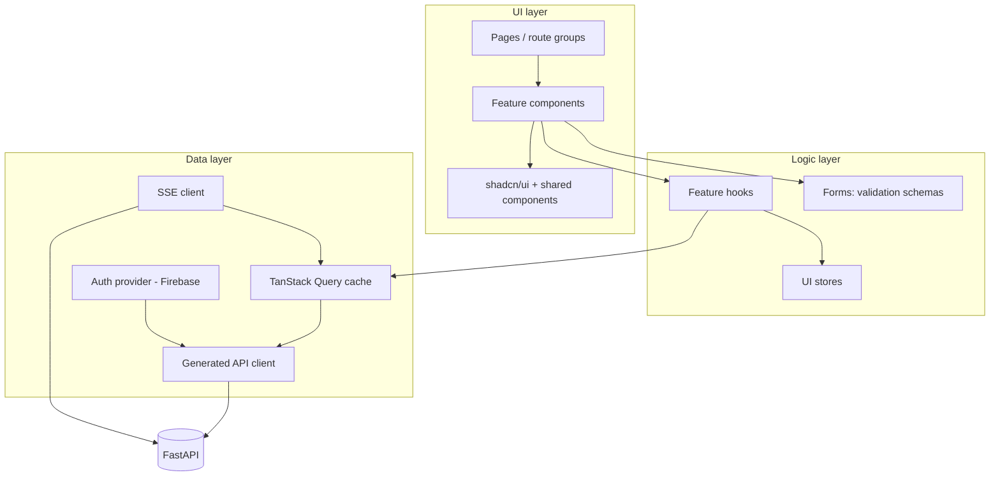
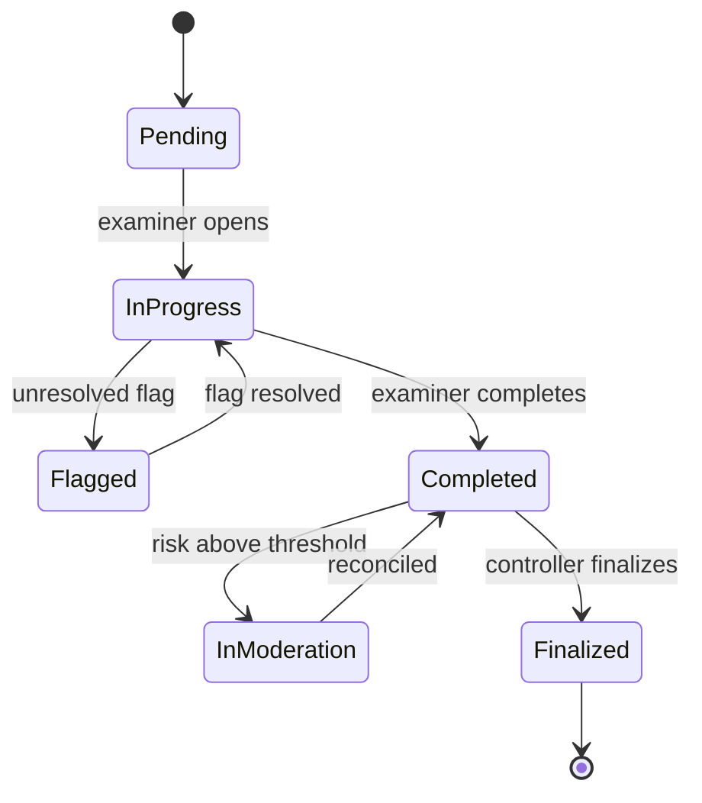
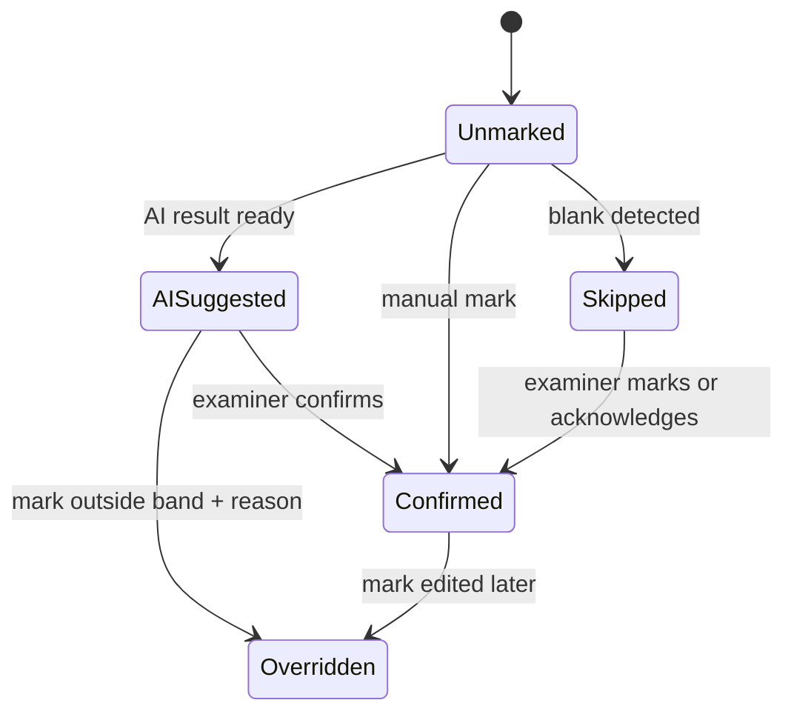
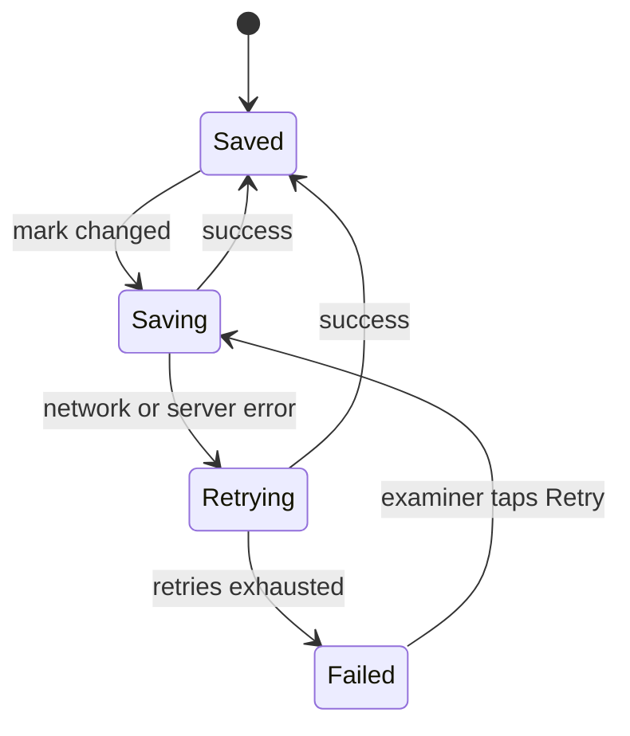

Frontend.md

## ExamSetu AI: Intelligent On-Screen Marking & Evaluation Ecosystem

|                       |                                               |
| --------------------- | --------------------------------------------- |
| **Document status**   | Draft v1.0                                    |
| **Date**              | 30 September 2026                             |
| **Related documents** | PRD.md, techstack.md, backend.md, database.md |

**Stack details are in `techstack.md`** (Next.js, Tailwind CSS, shadcn/ui,
TanStack Query, Recharts, next-intl, Firebase Auth, SSE). This file does not
repeat them; it covers **UI decisions, color theme, architecture, states and
theming**.

---

## 1. Frontend Goals

1. **Make the examiner faster without taking control away.** The interface
   presents AI help as a suggestion; the examiner's action is always the
   deciding one (PRD: _AI suggests, the human decides_).
2. **Reduce fatigue.** Calm colors, generous spacing, readable type in both
   English and Hindi, and dark mode for long sessions.
3. **Give controllers clarity at a glance.** Progress, risk and flags visible
   without digging.
4. **Work on tablets and phones** through a responsive layout. There is no
   offline mode.
5. **Be accessible and bilingual** (WCAG AA target; English and Hindi).

## 2. Users and Their Workspaces

| Role                | Primary device        | Workspace                                                            |
| ------------------- | --------------------- | -------------------------------------------------------------------- |
| **Examiner**        | Tablet, phone, laptop | Sheet queue, evaluation workspace, second-evaluation queue           |
| **Exam Controller** | Laptop / desktop      | Live dashboard, examiner analytics, flags, moderation rules, results |
| **Admin**           | Laptop / desktop      | Users and roles, exams and papers, assignments, audit log, settings  |

Each role gets its own route group and navigation, so no one sees screens that
are not theirs.

## 3. UI Decisions

### 3.1 Core principles

| Decision                                                                                                   | Reason                                                                                                             |
| ---------------------------------------------------------------------------------------------------------- | ------------------------------------------------------------------------------------------------------------------ |
| **AI content is always visually distinct** (violet "AI" badge and tint) from human actions (primary/green) | The examiner must always know what came from the AI and what they confirmed                                        |
| **The mark field is never auto-filled by the AI**                                                          | Prevents silent acceptance and over-reliance; the examiner types a mark or taps an explicit "Use suggested" action |
| **Suggestions are shown as score bands with a confidence badge**                                           | Matches the PRD (bands, not exact marks); communicates uncertainty honestly                                        |
| **Low-confidence answers show "Manual evaluation recommended"** and collapse the suggestion                | Matches PRD FR-3.4                                                                                                 |
| **Override reason dialog appears when the mark falls outside the suggested band**                          | Matches PRD FR-3.7                                                                                                 |
| **"Complete sheet" stays disabled while flags are unresolved**                                             | Matches PRD FR-4.3                                                                                                 |
| **Original scan is always one tap away from the transcription**                                            | The transcription is an aid, never the truth (PRD FR-2.2)                                                          |
| **Examiner screens never show student identity**                                                           | Anonymized scripts (PRD FR-11.2)                                                                                   |
| **Flags explain themselves** ("Flagged because…")                                                          | Malpractice flags are advisory and must be understandable (PRD FR-6.3, 6.4)                                        |
| **Autosave with a visible save status**                                                                    | No offline mode, so unsaved work must never be a surprise (PRD FR-9.2)                                             |
| **Color is never the only signal**; every status also has an icon and text label                           | Accessibility, and color-blind users                                                                               |
| **Examiners can turn AI suggestions off** in their preferences                                             | Supports independent judgment                                                                                      |

### 3.2 Examiner evaluation workspace

**Desktop / tablet landscape: split view**

```
┌──────────────────────────────────────────────────────────────┐
│ Top bar: sheet ID · progress · save status · language · theme │
├───────────────────────────────┬──────────────────────────────┤
│ SCAN VIEWER                   │ QUESTION NAVIGATOR (Q1 Q2 Q3…)│
│  zoom · pan · rotate · pages  │──────────────────────────────│
│                               │ TRANSCRIPTION (readable text) │
│  Original scan of the answer  │  low-confidence words marked  │
│                               │──────────────────────────────│
│                               │ AI SUGGESTION                 │
│                               │  score band · confidence      │
│                               │  diagram check                │
│                               │──────────────────────────────│
│                               │ MARK ENTRY · Confirm / Override│
│                               │ FLAGS for this question       │
├───────────────────────────────┴──────────────────────────────┤
│ Previous · Next question · Complete sheet (locked if flags)   │
└──────────────────────────────────────────────────────────────┘
```

**Phone / tablet portrait: stacked with tabs**

- Tabs: **Scan | Marking**. The scan takes the full screen; the marking panel
  opens as a bottom sheet.
- The question navigator becomes a horizontally scrollable strip.
- Touch targets are at least 44 × 44 px.

**Keyboard shortcuts (desktop):** `→` / `←` next / previous question, `Enter`
confirm mark, `O` open override reason, `T` toggle transcription, `+` / `-`
zoom. Shortcuts are listed in a help dialog and are not required to use the app.

### 3.3 Controller screens

| Screen         | Contents                                                                                                                            |
| -------------- | ----------------------------------------------------------------------------------------------------------------------------------- |
| **Dashboard**  | KPI cards (completion %, sheets pending, flags open, moderation queue), progress by subject/college, deadline status, live activity |
| **Examiners**  | Table of examiners with speed, average marks, spread, drift indicator; drill-down chart per examiner vs. peers                      |
| **Flags**      | Anomaly and malpractice flags with reason, severity and review action (Dismiss / Escalate / Send to moderation)                     |
| **Moderation** | Queue of routed sheets, side-by-side of first and second evaluation, reconcile action; rule/threshold settings                      |
| **Results**    | Batch summaries, finalization status, signed export                                                                                 |

### 3.4 Admin screens

| Screen             | Contents                                                       |
| ------------------ | -------------------------------------------------------------- |
| **Users**          | List, invite, set role, deactivate                             |
| **Exams & papers** | Create exam, paper, question structure, optional rubric upload |
| **Assignments**    | Assign scripts and examiners                                   |
| **Audit log**      | Searchable signed audit trail by sheet, examiner, time         |
| **Settings**       | Thresholds, language defaults                                  |

### 3.5 Navigation

- **Examiner:** top bar only (focus on the task), with a left drawer for the
  queue on tablets.
- **Controller and Admin:** collapsible left sidebar plus top bar; sidebar
  becomes a slide-over menu on tablets and phones.

### 3.6 Language and typography

- Interface switches between **English and Hindi** using a toggle in the top
  bar. Choice is remembered.
- **Latin text:** Inter. **Devanagari text:** Noto Sans Devanagari. Both loaded
  with `next/font`, with system-font fallbacks.
- Devanagari needs more vertical space, so `:lang(hi)` increases line height
  (see §5).
- Transcribed handwriting is displayed in its own language with the correct
  `lang` attribute so browsers pick the right font and hyphenation.
- Numbers, dates and marks use consistent formatting across languages.

### 3.7 Accessibility

- Target **WCAG 2.1 AA**: contrast, focus visibility, keyboard navigation,
  screen-reader labels.
- Live updates (progress, new flags) use `aria-live="polite"` regions.
- Dialogs trap focus and return it on close.
- Respect `prefers-reduced-motion`; animations are minimal.
- Scan viewer supports zoom to at least 300 % and does not depend on gestures
  alone (buttons provided).

## 4. Frontend Architecture

### 4.1 Layers



### 4.2 Folder structure

```
web/
├─ app/
│  ├─ globals.css                 ← all color variables and theme tokens (§5)
│  ├─ layout.tsx                  ← providers: theme, locale, auth, query
│  ├─ login/
│  ├─ (examiner)/examiner/
│  │   ├─ page.tsx                ← sheet queue
│  │   ├─ sheets/[sheetId]/       ← evaluation workspace
│  │   └─ second-evaluations/
│  ├─ (controller)/controller/
│  │   ├─ dashboard/  examiners/  flags/  moderation/  results/
│  └─ (admin)/admin/
│      ├─ users/  exams/  assignments/  audit/  settings/
├─ components/
│  ├─ ui/                         ← shadcn/ui primitives
│  └─ shared/                     ← StatusBadge, ConfidenceBadge, EmptyState, ErrorState, SaveStatus
├─ features/
│  ├─ examiner/                   ← ScanViewer, Transcription, SuggestionCard, MarkEntry, OverrideDialog, QuestionNav
│  ├─ controller/                 ← KpiCards, ProgressTable, ExaminerChart, FlagQueue, ModerationPanel
│  └─ admin/                      ← UserTable, InviteUserDialog, ExamForm, AuditTable
├─ lib/
│  ├─ api/                        ← generated client + auth interceptor
│  ├─ auth/                       ← Firebase setup, AuthProvider, role guard
│  ├─ realtime/                   ← SSE hook and event handlers
│  └─ utils/
├─ stores/                        ← small UI stores (viewer, preferences)
├─ messages/                      ← en.json, hi.json
└─ tests/
```

### 4.3 Routing and role protection

- Route groups `(examiner)`, `(controller)`, `(admin)` each have their own
  layout, navigation and guard.
- **Guard:** a layout-level component reads the signed-in user's role from
  Firebase token claims and redirects to the correct home or a "Not authorized"
  page.
- **This is for user experience only.** The real access control is enforced by
  FastAPI on every request; the frontend never treats a hidden screen as
  security.
- After login, users go to their role's home: `/examiner`,
  `/controller/dashboard` or `/admin/users`.

### 4.4 Data fetching

- **Generated TypeScript client** from the backend's OpenAPI spec, so request
  and response types are shared.
- An **interceptor** attaches the Firebase ID token as
  `Authorization: Bearer …`.
- **Error handling:** `401` → refresh token once, else sign out; `403` → "Not
  authorized" page; `5xx` / network → error state with Retry.
- **Prefetch** the next question's scan image while the examiner works on the
  current one.

### 4.5 Real-time updates

- A single SSE connection per signed-in session (fetch-based client, sends the
  Firebase token).
- Events update the TanStack Query cache directly, or invalidate affected
  queries:

| Event                      | Effect                                                       |
| -------------------------- | ------------------------------------------------------------ |
| Progress update            | Update dashboard counters and progress bars                  |
| New flag                   | Add to flag queue; show a toast to the controller            |
| Moderation assigned        | Update the second-evaluation queue for the assigned examiner |
| AI result chunk / complete | Stream into the suggestion card                              |

- On disconnect: automatic reconnect with backoff; a small "Live updates paused"
  indicator; fall back to polling every few seconds while disconnected.

### 4.6 Charts and visualization

- **Recharts** with chart colors from the theme variables (`--chart-1` …
  `--chart-5`), so charts follow light and dark mode automatically.
- Chart types: score distribution (histogram), marking time trend (line),
  examiner comparison (bar), flag summary (stacked bar).
- Every chart has a text or table alternative for accessibility.

## 5. Color Theme and `globals.css`

All colors live as **CSS variables in `app/globals.css`** (Next.js's default
global stylesheet name). Components use semantic Tailwind classes such as
`bg-primary` or `text-muted-foreground`; **no hard-coded hex values in
components**.

### 5.1 Palette intent

| Family                   | Meaning                                      | Look               |
| ------------------------ | -------------------------------------------- | ------------------ |
| **Primary**              | Brand, main actions, confirmed human actions | Deep academic blue |
| **AI**                   | Anything produced by AI                      | Violet             |
| **Success**              | Completed, confirmed, high confidence        | Green              |
| **Warning**              | Needs attention, medium confidence           | Amber              |
| **Destructive / Danger** | Errors, critical flags, low confidence       | Red                |
| **Info**                 | Neutral notices, in-progress                 | Sky blue           |
| **Neutrals**             | Surfaces, text, borders                      | Slate              |

The palette is deliberately calm (blue and slate) so long evaluation sessions
are not tiring, and reserves saturated color for meaning.

### 5.2 Token file

```css
/* app/globals.css */
@import "tailwindcss";

/* Dark mode is applied by adding the "dark" class to <html> (next-themes) */
@custom-variant dark (&:is(.dark *));

/* ───────────── Light theme (default) ───────────── */
:root {
    /* Surfaces */
    --background: #f8fafc;
    --foreground: #0f172a;
    --card: #ffffff;
    --card-foreground: #0f172a;
    --popover: #ffffff;
    --popover-foreground: #0f172a;

    /* Brand */
    --primary: #1e40af;
    --primary-foreground: #ffffff;
    --secondary: #f1f5f9;
    --secondary-foreground: #1e293b;
    --accent: #e0e7ff;
    --accent-foreground: #1e3a8a;

    /* Neutral support */
    --muted: #f1f5f9;
    --muted-foreground: #64748b;
    --border: #e2e8f0;
    --input: #cbd5e1;
    --ring: #3b82f6;

    /* Feedback */
    --destructive: #dc2626;
    --destructive-foreground: #ffffff;
    --success: #15803d;
    --success-soft: #dcfce7;
    --warning: #b45309;
    --warning-soft: #fef3c7;
    --info: #0369a1;
    --info-soft: #e0f2fe;

    /* AI-generated content */
    --ai: #7c3aed;
    --ai-foreground: #ffffff;
    --ai-soft: #ede9fe;

    /* Confidence levels (AI suggestions) */
    --confidence-high: var(--success);
    --confidence-medium: var(--warning);
    --confidence-low: var(--destructive);

    /* Sheet / question status */
    --status-pending: #64748b;
    --status-in-progress: var(--info);
    --status-flagged: var(--warning);
    --status-moderation: var(--ai);
    --status-completed: var(--success);
    --status-finalized: var(--primary);

    /* Flag severity */
    --severity-low: var(--info);
    --severity-medium: var(--warning);
    --severity-high: var(--destructive);

    /* Sidebar (controller / admin) */
    --sidebar: #0f172a;
    --sidebar-foreground: #e2e8f0;
    --sidebar-accent: #1e293b;
    --sidebar-accent-foreground: #ffffff;
    --sidebar-border: #1e293b;

    /* Charts */
    --chart-1: #2563eb;
    --chart-2: #ea580c;
    --chart-3: #0d9488;
    --chart-4: #7c3aed;
    --chart-5: #ca8a04;

    /* Shape and type */
    --radius: 0.5rem;
    --font-sans:
        var(--font-inter), var(--font-devanagari), system-ui, sans-serif;
}

/* ───────────── Dark theme ───────────── */
.dark {
    --background: #0b1220;
    --foreground: #e2e8f0;
    --card: #111a2e;
    --card-foreground: #e2e8f0;
    --popover: #111a2e;
    --popover-foreground: #e2e8f0;

    --primary: #60a5fa;
    --primary-foreground: #0b1220;
    --secondary: #1e293b;
    --secondary-foreground: #e2e8f0;
    --accent: #1e2a4a;
    --accent-foreground: #c7d2fe;

    --muted: #1e293b;
    --muted-foreground: #94a3b8;
    --border: #263248;
    --input: #334155;
    --ring: #60a5fa;

    --destructive: #f87171;
    --destructive-foreground: #0b1220;
    --success: #4ade80;
    --success-soft: #052e16;
    --warning: #fbbf24;
    --warning-soft: #422006;
    --info: #38bdf8;
    --info-soft: #082f49;

    --ai: #a78bfa;
    --ai-foreground: #0b1220;
    --ai-soft: #2e1065;

    --status-pending: #94a3b8;

    --sidebar: #070d18;
    --sidebar-foreground: #cbd5e1;
    --sidebar-accent: #1e293b;
    --sidebar-accent-foreground: #ffffff;
    --sidebar-border: #1e293b;

    --chart-1: #60a5fa;
    --chart-2: #fb923c;
    --chart-3: #2dd4bf;
    --chart-4: #a78bfa;
    --chart-5: #facc15;
}

/* ───────────── Expose variables as Tailwind utilities ───────────── */
@theme inline {
    --color-background: var(--background);
    --color-foreground: var(--foreground);
    --color-card: var(--card);
    --color-card-foreground: var(--card-foreground);
    --color-popover: var(--popover);
    --color-popover-foreground: var(--popover-foreground);

    --color-primary: var(--primary);
    --color-primary-foreground: var(--primary-foreground);
    --color-secondary: var(--secondary);
    --color-secondary-foreground: var(--secondary-foreground);
    --color-accent: var(--accent);
    --color-accent-foreground: var(--accent-foreground);
    --color-muted: var(--muted);
    --color-muted-foreground: var(--muted-foreground);
    --color-border: var(--border);
    --color-input: var(--input);
    --color-ring: var(--ring);

    --color-destructive: var(--destructive);
    --color-destructive-foreground: var(--destructive-foreground);
    --color-success: var(--success);
    --color-success-soft: var(--success-soft);
    --color-warning: var(--warning);
    --color-warning-soft: var(--warning-soft);
    --color-info: var(--info);
    --color-info-soft: var(--info-soft);

    --color-ai: var(--ai);
    --color-ai-foreground: var(--ai-foreground);
    --color-ai-soft: var(--ai-soft);

    --color-confidence-high: var(--confidence-high);
    --color-confidence-medium: var(--confidence-medium);
    --color-confidence-low: var(--confidence-low);

    --color-status-pending: var(--status-pending);
    --color-status-in-progress: var(--status-in-progress);
    --color-status-flagged: var(--status-flagged);
    --color-status-moderation: var(--status-moderation);
    --color-status-completed: var(--status-completed);
    --color-status-finalized: var(--status-finalized);

    --color-severity-low: var(--severity-low);
    --color-severity-medium: var(--severity-medium);
    --color-severity-high: var(--severity-high);

    --color-sidebar: var(--sidebar);
    --color-sidebar-foreground: var(--sidebar-foreground);
    --color-sidebar-accent: var(--sidebar-accent);
    --color-sidebar-accent-foreground: var(--sidebar-accent-foreground);
    --color-sidebar-border: var(--sidebar-border);

    --color-chart-1: var(--chart-1);
    --color-chart-2: var(--chart-2);
    --color-chart-3: var(--chart-3);
    --color-chart-4: var(--chart-4);
    --color-chart-5: var(--chart-5);

    --radius-sm: calc(var(--radius) - 4px);
    --radius-md: calc(var(--radius) - 2px);
    --radius-lg: var(--radius);
    --radius-xl: calc(var(--radius) + 4px);

    --font-sans: var(--font-sans);
}

/* ───────────── Base styles ───────────── */
@layer base {
    * {
        border-color: var(--border);
    }
    body {
        background: var(--background);
        color: var(--foreground);
        font-family: var(--font-sans);
        line-height: 1.6;
    }
    /* Devanagari needs extra vertical room */
    :lang(hi) {
        line-height: 1.85;
    }

    :focus-visible {
        outline: 2px solid var(--ring);
        outline-offset: 2px;
    }
    @media (prefers-reduced-motion: reduce) {
        * {
            animation-duration: 0.01ms !important;
            transition-duration: 0.01ms !important;
        }
    }
}
```

### 5.3 Usage rules

| Rule                                                                        | Example                                                       |
| --------------------------------------------------------------------------- | ------------------------------------------------------------- |
| Use semantic classes, never raw colors                                      | `bg-card text-card-foreground`, not `bg-white text-slate-900` |
| AI content always uses the `ai` family                                      | `bg-ai-soft text-ai border-ai` on the suggestion card         |
| Status and severity always use their own tokens                             | `text-status-flagged`, `border-severity-high`                 |
| Chart series use `--chart-*` in order                                       | `stroke="var(--chart-1)"`                                     |
| New colors are added to `globals.css` first, then mapped in `@theme inline` | Keeps the palette in one place                                |

### 5.4 Contrast

Text and background pairs in the token file were chosen to meet **WCAG AA (4.5:1
for normal text)**. Verify each pair with a contrast checker before release, and
re-check whenever a token changes.

## 6. Theming (Light, Dark, System)

- **Options:** Light, Dark, **System** (default, follows the device).
- **Mechanism:** `next-themes` adds the `dark` class to `<html>`; the variables
  in §5.2 switch automatically.
- **Toggle:** a sun/moon/system menu in the top bar of every role's layout.
- **Persistence:** the choice is remembered on the device. To avoid a flash of
  the wrong theme on load, the provider sets the class before first paint.
- **Images:** scanned answer sheets are shown as-is in both themes (never
  inverted). The scan viewer sits on a neutral mid-tone backdrop in both modes
  so paper stays readable.
- **Scope:** every component must be checked in both themes before it is
  considered done.

## 7. State Management

### 7.1 Kinds of state and where they live

| Kind                   | Examples                                                                        | Tool                                              |
| ---------------------- | ------------------------------------------------------------------------------- | ------------------------------------------------- |
| **Server state**       | Sheets, marks, flags, analytics, users, exams                                   | **TanStack Query** (cache, refetch, invalidation) |
| **Real-time state**    | Live progress, new flags, AI result stream                                      | **SSE client** writing into the Query cache       |
| **Auth state**         | Signed-in user, role claim, token                                               | **Firebase Auth** + `AuthProvider` context        |
| **UI / viewer state**  | Zoom, rotation, active question, panel open/closed, show-suggestions preference | **Zustand** (small stores)                        |
| **Form state**         | Mark entry, override reason, invite user, exam setup                            | **React Hook Form** + **Zod** validation          |
| **URL state**          | Filters, sort order, selected sheet, table page                                 | Route and search params                           |
| **Theme and language** | Light/dark/system; English/Hindi                                                | `next-themes`; `next-intl` (cookie)               |

**Rule:** never copy server data into a UI store. Server data stays in the Query
cache; UI stores hold only interface details.

### 7.2 Sheet and question states shown in the UI

The values come from the API; the UI maps each to a status token, icon and
label.

**Sheet status**



| Status        | Token                | Icon + label               |
| ------------- | -------------------- | -------------------------- |
| Pending       | `status-pending`     | Clock, "Pending"           |
| In progress   | `status-in-progress` | Pencil, "In progress"      |
| Flagged       | `status-flagged`     | Flag, "Needs attention"    |
| In moderation | `status-moderation`  | Users, "Second evaluation" |
| Completed     | `status-completed`   | Check, "Completed"         |
| Finalized     | `status-finalized`   | Lock, "Finalized"          |

**Question (answer) state within a sheet**



### 7.3 AI suggestion states

| State            | What the examiner sees                                                    |
| ---------------- | ------------------------------------------------------------------------- |
| `idle`           | Nothing yet (or suggestions turned off)                                   |
| `queued`         | "Preparing suggestion…" with skeleton                                     |
| `streaming`      | Suggestion card filling in progressively                                  |
| `ready`          | Score band, confidence badge, short reasons                               |
| `low_confidence` | "Manual evaluation recommended", suggestion collapsed                     |
| `failed`         | "Suggestion unavailable" with Retry; marking is fully possible without it |

The AI being unavailable never blocks evaluation.

### 7.4 Save states (autosave)



| State    | Indicator (top bar)                                                      |
| -------- | ------------------------------------------------------------------------ |
| Saved    | Check + "Saved"                                                          |
| Saving   | Spinner + "Saving…"                                                      |
| Retrying | Amber + "Reconnecting…"                                                  |
| Failed   | Red + "Not saved. Retry" (navigation to another sheet is warned against) |

Each mark is submitted with a client-generated ID so a retry never creates a
duplicate (details in `backend.md`).

### 7.5 Standard screen states

Every data-driven screen implements all four:

| State                   | Treatment                                                     |
| ----------------------- | ------------------------------------------------------------- |
| **Loading**             | Skeletons that match the final layout (no full-page spinners) |
| **Empty**               | Friendly message with next action ("No sheets assigned yet")  |
| **Error**               | Clear message, error code for support, **Retry** button       |
| **Stale / live paused** | Small indicator when SSE is disconnected and data may lag     |

### 7.6 Auth states

| State          | Behavior                                                     |
| -------------- | ------------------------------------------------------------ |
| `loading`      | Splash while Firebase restores the session                   |
| `signedOut`    | Redirect to `/login`                                         |
| `signedIn`     | Role read from claims; redirect to role home                 |
| `unauthorized` | "Not authorized" page if a role opens another role's route   |
| `expired`      | Token refresh attempted; on failure, sign out with a message |

## 8. Forms and Validation

- **Zod schemas** validate before submit; server errors are mapped back to
  fields.
- **Mark entry:** number within the question's maximum, in allowed increments;
  out-of-band values open the override dialog, and the reason is required.
- **Inline validation** with clear, translated messages in English and Hindi.
- **Destructive actions** (deactivate user, finalize results) use a confirm
  dialog that names the consequence.

## 9. Notifications and Feedback

- **Toasts** for short, non-blocking events (saved, flag raised, sheet routed to
  moderation).
- **Banners** for persistent conditions (live updates paused, deadline near).
- **Dialogs** only when a decision is required.
- Toast colors use the success / warning / destructive / info tokens, always
  with an icon.

## 10. Performance

- Route-level code splitting by role group, so examiners never download admin
  code.
- Scan images are loaded through the storage service's short-lived links, sized
  to the viewer, and the **next question's image is prefetched**.
- Large tables use pagination or virtualization.
- Charts render from aggregated data supplied by the API, not raw rows.

## 11. Testing

| Level            | Tool (see `techstack.md`)               | Focus                                                                                                                                   |
| ---------------- | --------------------------------------- | --------------------------------------------------------------------------------------------------------------------------------------- |
| Unit / component | Vitest                                  | Mark-entry rules, status mapping, theme tokens, formatters                                                                              |
| End-to-end       | Playwright                              | Examiner flow: open sheet → view suggestion → override with reason → resolve flag → complete; controller flag review; admin invite user |
| Visual / theme   | Playwright screenshots                  | Light and dark, English and Hindi, tablet and phone widths                                                                              |
| Accessibility    | Automated checks + manual keyboard pass | Contrast, focus order, screen-reader labels                                                                                             |
